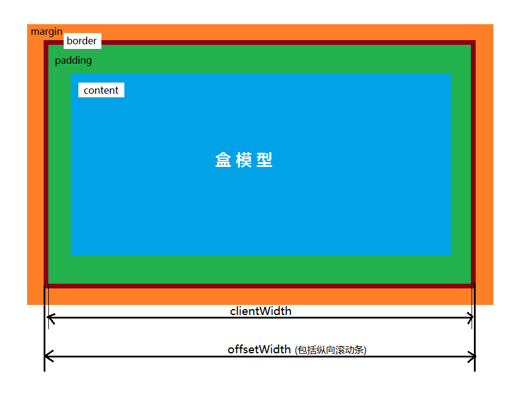

# css 夯实基础
## 一、选择器&层叠

### 1. 常见选择器

- 元素选择器
- 群组选择器
- class、id选择器
- 属性选择器[class] =   *=  |=   ~=   ^=   $=
- 基于文档结构的后代选择器
- 伪类选择器（拼接伪类、结构伪类、动态伪类、ui状态伪类、:target、:lang、:not()）
- 伪元素选择器

### 2. 层叠

在学习本节内容之前先理解以下几个概念：

- 继承--是指将元素的属性值应用到子代元素上的机制。

- 特指度

  ```js
  0,0,0,0（* 的特指度）	//继承没有特指度，连0,0,0,0都不是
  //1)0 代表style设置的特指度
  //2)0 代表id选择器的特指度
  //3)0 代表class选择器、属性选择器、伪类的特指度
  //4)0 代表元素|标签选择器、伪元素的特指度
  
  !important为重要声明
  ```

- 层叠

  层叠是确定样式的哪些属性值应用到元素上的过程。要考虑声明方式、声明来源（编辑者、读者、用户代理）、声明特指度。

  并且要注意：**层叠针对的是同一属性的层叠！！！**

## 二、盒模型



### 2.1 标准盒模型和怪异盒模型

```
二者区别在于：在设置border和padding时应该从盒子内部绘制还是外部绘制。
```

标准盒模型:这种盒模型设置width的时候的值是内容区的宽度,如果再设置padding和border的话盒子的实际宽度会增大
怪异盒模型:这种盒子的width设置的值为盒子实际的宽度,border和padding的设置不会影响盒子的实际宽度和高度

### 2.2 JS取宽高

```js
clientHeight = 内容高度 + padding(top、bottom)
offsetHeight = 内容高度 + padding(top、bottom) + border(top、bottom) + 横向滚动条高度
scrollHeight = clientHeight + 隐藏部分的高度

//jQuery获取元素高度接口
.height() = 内容高度
.innerHeight() = 内容高度 + padding(top、bottom) + 横线滚动条高度（挤占内容）
.outerHeight() = 内容高度 + padding(top、bottom) + border(top、bottom)
.outerHeight(true) = 内容高度 + padding(top、bottom) + border(top、bottom) + margin(top、bottom)
```

### 2.3 BFC块级格式化上下文

```
【box】是css布局的基本单位，一个页面有多个box组成。元素的类型和display属性决定了box的类型。主要分为：
	块级box（div,p,h1-h6,table,ul,li）
	行级box(span,input,)
	
【格式化上下文】是页面的一个渲染区域，他有一套渲染规则，决定改了其子元素将如何定位以及与其他元素的关系和相互作用。
最常见的是BFC和IFC
```

​		**BFC(Block Formatting Context)**是一个独立的布局环境，其中的元素布局不受外界影响，并且在一个BFC中，块盒与行盒（行盒由一行中所有的内敛元素所组成）会都会垂直沿着其父元素的边框排列。
**BFC的布局规则：**

- BFC是独立的渲染容器，子元素与外部元素互不影响
- 内部的box会在垂直方向，一个接一个放置（没有float的情况下）
- 每个盒子（块盒与行盒及浮动元素）的左边距会与BFC区域左边框处相接
- 同一个BFC内两个相邻的box的垂直距离由margin决定，margin会发生重叠
- BFC区域不会与浮动元素重叠；（两列布局：一个float，一个overflow）
- 计算BFC高度时，浮动元素也参与计算；（(对于父元素高度塌陷问题，可为父元素设置display为auto、hidden)）

**如何创建BFC：**

1. display为inline-block|inline-flex、table-cell、flex、table-caption
2. float不为none
3. overflow不为visible
4. position不为static或relative

**场景：**

解决元素重叠、清除浮动（高度塌陷）、外边距折叠问题

## 三、布局

#### 3.1 css单位

px 像素

% 百分比，可实现自适应比例

em 相对长度单位，表示元素的font-size的计算值。元素级联em，按比例放大。

ex 表示元素font的x-height，在含有"X"字母的字体中，它是该字体的小写字母的高度；对于很多字体来说，1ex≈0.5em

rem 表示根元素html的font-size大小，当用在根元素的font-size上时，代表了它的初始值。

vw|vh 代表视口初始包含块的高度的1%；

wmin|vmax min(vw|vh)

**属性使用百分比**

position:absoulte 其margin、padding、left的值相对最近父元素的width而言，而top相对高度
position:relative
position:fixed
background-size
border-radius
transform:translate
margin、padding
text-indent
line-height
font-size

#### 3.2 一些布局实例

##### 1. 两列布局

```html
1.使用float+calc
2.使用table布局
3.使用flex布局
```

##### 2. 三列布局

```html
<style>
      .box {
        display: flex;
      }
      .one,.two,.three {
        flex: 1 1 auto;
      }
</style>

<div class="box">
        <div class="one">One</div>
        <div class="two">Two</div>
        <div class="three">Three</div>
      </div>
```


##### 3. 表格布局

```html
<style>
.container{
    height:200px;
    width: 200px;
}
.left{
    background-color: red
}
.right{
    background-color: green
}
</style>
<body>
    <table class=container>
        <tbody>
            <tr>
                <td class=left> 左 </td>
                <td class=right> 右 </td>
            </tr>
        </tbody>
    </table>
</body>

//改进
<style>
.table{
    display: table
}
.left{
    display: table-cell;
}
.right{
    display: table-cell
}
</style>

<div class=table>
    <div class=left></div>
    <div class=right></div>
</div>
```

但是它也有自身的局限性，比如 table 比其它 html 标记占更多的字节（造成下载时间延迟,占用服务器更多流量资源），table 会阻挡浏览器渲染引擎的渲染顺序。(会延迟页面的生成速度,让用户等待更久的时间)，但是某些情况下，当采用其他方式不能很好的达到自己的效果时，采用 table 布局能适应当前场景。

4. Step-item内容宽度自适应布局

```js
// 每个step项内横线宽度根据内容宽度自适应

<div class="step">
	<div class="title">这里是标题</div>  
  <div class="content">这里是内容部分。</div> 
</div>

.title::after{
  display: block;
  content: '';
  width:50000;
  height:1px;
  color: cyan;
  position: absolute;
  left: 100%; // left百分比为占据父元素宽度的百分比
}
```


#### 3.3 **响应式布局**

**（1）允许网页宽度自动调整**

首先，在网页代码的头部，加入一行viewport元标签。

```html
<meta name=”viewport” content=”width=device-width, initial-scale=1″ />
```

viewport是网页默认的宽度和高度，上面这行代码的意思是，网页宽度默认等于屏幕宽度（width=device-width），原始缩放比例（initial-scale=1）为1.0，即网页初始大小占屏幕面积的100%。

所有主流浏览器都支持这个设置，包括IE9。对于那些老式浏览器（主要是IE6、7、8），需要使用css3-mediaqueries.js。

```html
<!–[if lt IE 9]><script src=”http://css3-mediaqueries-js.googlecode.com/svn/trunk/css3-mediaqueries.js”></script><![endif]–>
```

**（2）使用CSS3媒体查询@media 查询**

媒体查询有三种表达方式：

**1.直接在CSS文件中使用**

```css
/**@media 类型 and (条件1) and (条件二)
{
 css样式
}*/
@media screen and (max-width:980px ) {
 body{
 background-color: red;
 }
}
```

**2.使用@import导入**

```
@import url("css/moxie.css") all and (max-width:980px);
```

**3.也是最常用的：使用link连接，media属性用于设置查询方式：**

```html
<link rel="stylesheet" media="mediatype and|not|only (media feature)" href="mystylesheet.css">
```

**（3）其他注意点**

**1.不使用绝对宽度**

由于网页会根据屏幕宽度调整布局，所以不能使用绝对宽度的布局，也不能使用具有绝对宽度的元素。这一条非常重要。具体说，CSS代码不能指定像素宽度：`width:xxx px;`只能指定百分比宽度：`width: xx%;`或者`width:auto;`

**2.使用相对大小的字体rem而不是px**

css中字体常用单位px、em、rem和%的区别及用法总结见：https://www.cnblogs.com/vickylinj/p/10931735.html

**3.流动布局（fluid grid）**

“流动布局”的含义是，各个区块的位置都是浮动的，不是固定不变的。

```
.main {float: right;width: 70%;}
.leftBar {float: left;width: 25%;}
```

float的好处是，如果宽度太小，放不下两个元素，后面的元素会自动滚动到前面元素的下方，不会在水平方向overflow（溢出），避免了水平滚动条的出现。

另外，绝对定位（`position: absolute`）的使用，也要非常小心。

**4.图片的自适应（fluid image）**

除了布局和文本，”自适应网页设计”还必须实现图片的自动缩放。

这只要一行CSS代码：

```css
img { max-width: 100%;}
```

这行代码对于大多数嵌入网页的视频也有效，所以可以写成：

```css
img, object { max-width: 100%;}
```

老版本的IE不支持max-width，所以只好写成：

```css
img { width: 100%; }
```

此外，windows平台缩放图片时，可能出现图像失真现象。这时，可以尝试使用IE的专有命令：

```css
img { -ms-interpolation-mode: bicubic; }
```

或者，Ethan Marcotte的**imgSizer.js**：

```css
addLoadEvent(function() {
 var imgs = document.getElementById("content").getElementsByTagName("img");
 imgSizer.collate(imgs);
});
```


## 四、定位

### 3.1 table布局（可兼容ie8）

```css
.parent{
	display:inline-table;
	width:800px;
 	height:800px;
}
.box{
	display:table-cell;
	vertical-align:middle;
}
```

### 3.2 定位+margin:auto;inset：0;(固定宽高)

```css
.container{
    position:relative;
    width:800px;
    height:800px;
    background-color:red;
}
.box{
    background-color: gold;
    width:200px;
    height:200px;
    position:absolute;
    left:0;right:0;top:0;bottom:0;
    margin:auto;
}
```

### 3.3 定位+left:x+margin|transform:translate(x)


### 3.4 flex弹性布局

  容器属性
  项目属性

## 五、图文样式


​		

#### 5.1 web安全色

基于不同的平台（如PC、Mac等）的web浏览器，在显示颜色上可能会有差异，倘若浏览器没有指定的颜色，就会通过抖动或者混合自身的颜色来尝试生成相近的颜色。以前的电脑显示器最多支持256种颜色，但能够在任何显示器上显示一样的样色只有216种。

查看web安全色：https://www.bootcss.com/p/websafecolors/

**颜色的表示方式**

```js
//十六进制表示
#000000~#FFFFFF 有时#cc3300会简写为#c30
//RGB(x,y,z)表示 每个数值在0~255之间
(255,0,0) 红色
//关键字表示法
aqua 湖绿色
black
blue
cyan 青色
fuchsia 紫红色
gray
green
lime
maroon 紫褐色
navy
olive 橄榄绿
purple
red
silver
teal 蓝绿色
white
yellow
```


#### 5.2 属性继承

css样式表继承指的是，特定的css属性向下传递到后代元素。

所有元素可继承

```css
visibility、opacity
cursor
```

内联元素可继承

```css
letter-spacing、word-spacing、white-space
line-height
font、font-family、font-family、font-style、font-weight
text-decoration、text-transform
direction
color
```

块状元素可继承

```css
text-indent
text-align
```

列表元素可继承

```css
list-style-type 设置列表项标记的类型
list-style-position 设置在何处放置列表标记项
list-style-image 使用图像来替换列表项的标记
list-style
```

表格元素可继承

```css
border-collapse
```

不可继承属性

展示及内部元素排列：display、vertical-align、overflow

盒模型属性：width、min-width、max-width、margin、padding、border

定位及浮动：position、left...、z-index、float、clear

背景：background

页面样式属性：page-break-before、page-break-after

轮廓样式属性：outline-style、outline-width、outline-color、outline

Unicode-bidi

#### 5.3 简写属性

font : font-style || font-variant || font-weight || font-size || line-height || font-family 
background: color url repeat attachment position

List-style:list-style-type||list-style-position||list-type-image

Flex:flex-grow`，`flex-shrink`，`flex-basis

#### 5.4 区别属性

```js
display:none 
//不占空间，会引起回流重绘；
//事件通过其他方式仍可触发；
//子元素不继承，无法实现；从无到有，不支持过渡
visibility:hidden;   
//占位，只会引起重绘；
//元素隐藏后，事件不可触发；
//子元素继承，可覆盖属性使得父元素不显示，子元素显示
opacity:0; 
//占位
//点击事件仍可触发
//子元素可继承该属性，而且是叠加继承（0.2*0.5那种）故达不到父元素显示，子元素不显示效果
color: rgba(0,0,0,0.5); //a不会被继承
```

应用场景：

- 页面初始化加载时，显示“正在加载”图片，加载完毕后通过回调函数隐藏该图片，如果图片过多，反复引发页面回流重排会是页面发生抖动；
- echarts画布大小是基于容器大小的，如果通过display控制显示隐藏，需要调resize方法，不然会出现图片挤成一团的现象，还会出现卡顿；
- 在使用过渡属性时，不要使用display:none，会使transition属性失效；

## 六、2D&3D转换|过渡|动画和渐变

- transform
- transition
- animation

#### 6.1 transform

**2D转换：**

```css
translate
rotate
scale
skew
matrix
```

**3D转换**

```css
translate3d
rotate3d
scale3d
skew
matrix3d
```

#### 6.2 transition

**使用方式**

```css
transition: 1s 1s height ease;
transition-property: height;
transition-duration: 1s;
transition-delay: 1s;
transition-timing-function: ease;/*linear ease-in ease-out cubic-bezier(.83,.97,.05,1.44)*/
```

**局限性**

transition的优点在于简单易用，但是它有几个很大的局限。

（1）transition需要事件触发，所以没法在网页加载时自动发生。

（2）transition是一次性的，不能重复发生，除非一再触发。

（3）transition只能定义开始状态和结束状态，不能定义中间状态，也就是说只有两个状态。并且需要明确直到开始状态和结束状态的具体数值，才能计算出中间状态。比如，height从0px变化到100px，transition可以算出中间状态。但是，transition没法算出0px到auto的中间状态，也就是说，如果开始或结束的设置是height: auto，那么就不会产生动画效果。类似的情况还有，display: none到block，background: url(foo.jpg)到url(bar.jpg)等等。

（4）一条transition规则，只能定义一个属性的变化，不能涉及多个属性。

CSS Animation就是为了解决这些问题而提出的。

#### 6.3 animation

**使用方式**

```css
animation-duration: 1s;
animation-delay: 1s;
animation-name: rainbow;
animation-timing-function: linear;
animation-iteration-count: 3;
animation-fill-mode:
		none 默认值，回到动画没开始的状态；
		backwards 结束回到第一帧的状态
		forwards  保留在结束状态
		both      轮流应用forwards和backwards
animation-direction
		normal
		alternate
		reverse
		alternate-reverse

div:hover {
  animation: 1s 1s rainbow linear 3 forwards normal;
}
@keyframes rainbow {
  0% { background: #c00; }
  50% { background: orange; }
  100% { background: yellowgreen; }
}
//如果想让动画保持终止时的状态
animation-play-state: paused; //running
```

**`window.requestAnimationFrame()`** 告诉浏览器——你希望执行一个动画，并且要求浏览器在下次重绘之前调用指定的回调函数更新动画。该方法需要传入一个回调函数作为参数，该回调函数会在浏览器下一次重绘之前执行.

当你准备更新动画时你应该调用此方法。这将使浏览器在下一次重绘之前调用你传入给该方法的动画函数(即你的回调函数--该回调函数会被传入[`DOMHighResTimeStamp`](https://developer.mozilla.org/zh-CN/docs/Web/API/DOMHighResTimeStamp)参数，该参数与[`performance.now()`](https://developer.mozilla.org/zh-CN/docs/Web/API/Performance/now)的返回值相同，它表示`requestAnimationFrame()` 开始去执行回调函数的时刻)。回调函数执行次数通常是每秒60次，但在大多数遵循W3C建议的浏览器中，回调函数执行次数通常与浏览器屏幕刷新次数相匹配。

**返回值**

一个 `long` 整数，请求 ID ，是回调列表中唯一的标识。是个非零值，没别的意义。你可以传这个值给 [`window.cancelAnimationFrame()`](https://developer.mozilla.org/zh-CN/docs/Web/API/Window/cancelAnimationFrame) 以取消回调函数。

#### 6.4 gradient


 

 

CSS浮动和定位：

​	脱离文档流，

​	定位宽度设置相对浏览器窗口。

CSS布局之垂直居中：

https://baijiahao.baidu.com/s?id=1645296170141430719&wfr=spider&for=pc

https://blog.csdn.net/weixin_43720095/article/details/89061246

https://www.cnblogs.com/serdy/p/11779479.html

https://segmentfault.com/a/1190000016389031

 

Flex布局

1.基础简介https://www.runoob.com/w3cnote/flex-grammar.html

2.知识总结https://www.cnblogs.com/hellocd/p/10443237.html

3.兼容性[https://caniuse.com/#feat=flexbox](#feat=flexbox)

 

Grid布局

http://www.ruanyifeng.com/blog/2019/03/grid-layout-tutorial.html


## ***\*CSS Hack\****

​	简单的说，CSS hack的目的就是使你的CSS代码兼容不同的浏览器。当然，我们也可以反过来利用CSS hack为不同版本的浏览器定制编写不同的CSS效果。

 

​	CSS Hack大致有3种表现形式，CSS类内部Hack、选择器Hack以及HTML头部引用(if IE)Hack，CSS Hack主要针对类内部[Hack](https://baike.baidu.com/item/Hack)：比如 IE6能识别下划线"_"和星号" * "，IE7能识别星号" * "，但不能识别下划线"_"，而firefox两个都不能认识。

（1）方式一 条件注释法

只在IE下生效

<!--[if IE]>

这段文字只在IE浏览器显示

<![endif]-->

只在IE6下生效

<!--[if IE 6]>

这段文字只在IE6浏览器显示

<![endif]-->

只在IE6以上版本生效

<!--[if gte IE 6]>

这段文字只在IE6以上(包括)版本IE浏览器显示

<![endif]-->

只在IE8上不生效

<!--[if ! IE 8]>

这段文字在非IE8浏览器显示

<![endif]-->

非IE浏览器生效

<!--[if !IE]>

这段文字只在非IE浏览器显示

<![endif]-->

（2）方式二 类内属性前缀法

属性前缀法是在CSS样式属性名前加上一些只有特定浏览器才能识别的hack前缀，以达到预期的页面展现效果。 

说明：在标准模式中

· “-″减号是IE6专有的hack

· “\9″ IE6/IE7/IE8/IE9/IE10都生效

· “\0″ IE8/IE9/IE10都生效，是IE8/9/10的hack

· “\9\0″ 只对IE9/IE10生效，是IE9/10的hack

（3）CSS hack方式三：选择器前缀法

​	选择器前缀法是针对一些页面表现不一致或者需要特殊对待的浏览器，在CSS选择器前加上一些只有某些特定浏览器才能识别的前缀进行hack。

目前最常见的是

​	*html 	*前缀只对IE6生效

​	*+html 	*+前缀只对IE7生效

​	@media screen\9{...}	只对IE6/7生效

​	@media \0screen {body { background: red; }}只对IE8有效

​	@media \0screen\,screen\9{body { background: blue; }}只对IE6/7/8有效

​	@media screen\0 {body { background: green; }} 只对IE8/9/10有效

​	@media screen and (min-width:0\0) {body { background: gray; }} 只对IE9/10有效

​	@media screen and (-ms-high-contrast: active), (-ms-high-contrast: none) {body { background: orange; }} 只对IE10有效等等

 

## ***\*不同浏览器对和模型的解释不同\****

\1. 标准模型&IE模型

​	https://www.wandouip.com/t5i93928/

​	css3用这句把盒模型设为怪异模式就一致了：	box-sizing: border-box;

\2. 
