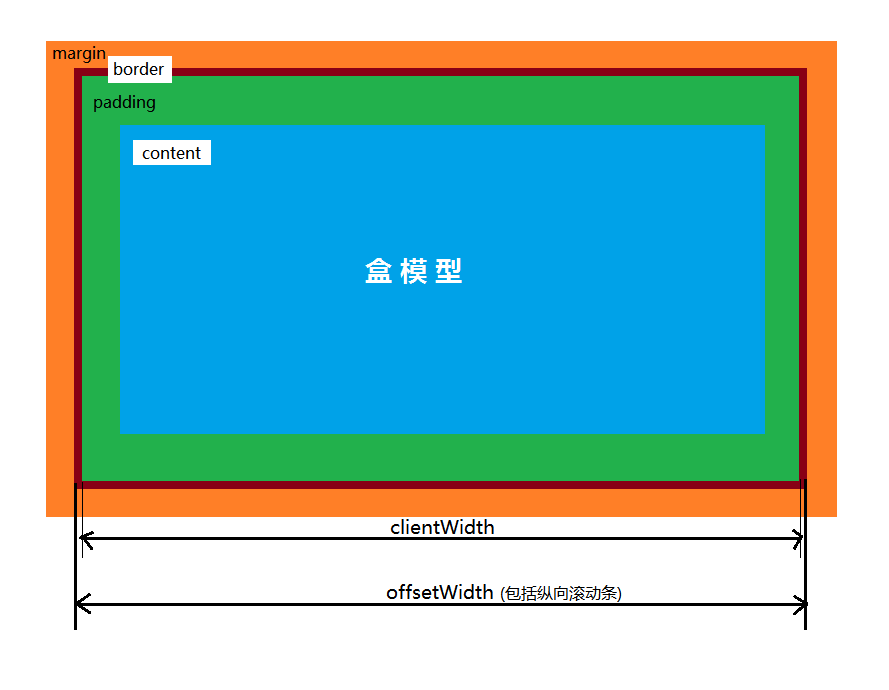

# css 夯实基础
## 一、选择器

```css
//优先级
!important 
style 
#id 
.class 
tag [type='text'] 
> + ~
```


## 二、盒模型



### 2.1 标准盒模型和怪异盒模型

```
二者区别在于：在设置border和padding时应该从盒子内部绘制还是外部绘制。
```

标准盒模型:这种盒模型设置width的时候的值是内容区的宽度,如果再设置padding和border的话盒子的实际宽度会增大
怪异盒模型:这种盒子的width设置的值为盒子实际的宽度,border和padding的设置不会影响盒子的实际宽度和高度

### 2.2 JS取宽高

```js
clientHeight = 内容高度 + padding(top、bottom)
offsetHeight = 内容高度 + padding(top、bottom) + border(top、bottom) + 横向滚动条高度
scrollHeight = clientHeight + 隐藏部分的高度

//jQuery获取元素高度接口
.height() = 内容高度
.innerHeight() = 内容高度 + padding(top、bottom) + 横线滚动条高度（挤占内容）
.outerHeight() = 内容高度 + padding(top、bottom) + border(top、bottom)
.outerHeight(true) = 内容高度 + padding(top、bottom) + border(top、bottom) + margin(top、bottom)
```

### 2.3 BFC块级格式化上下文

```
【box】是css布局的基本单位，一个页面有多个box组成。元素的类型和display属性决定了box的类型。主要分为：
	块级box（div,p,h1-h6,table,ul,li）
	行级box(span,input,)
	
【格式化上下文】是页面的一个渲染区域，他有一套渲染规则，决定改了其子元素将如何定位以及与其他元素的关系和相互作用。
最常见的是BFC和IFC
```

​		**BFC(Block Formatting Context)**是一个独立的布局环境，其中的元素布局不受外界影响，并且在一个BFC中，块盒与行盒（行盒由一行中所有的内敛元素所组成）会都会垂直沿着其父元素的边框排列。
**BFC的布局规则：**

- BFC是独立的渲染容器，子元素与外部元素互不影响
- 内部的box会在垂直方向，一个接一个放置（没有float的情况下）
- 每个盒子（块盒与行盒及浮动元素）的左边距会与BFC区域左边框处相接
- 同一个BFC内两个相邻的box的垂直距离由margin决定，margin会发生重叠
- BFC区域不会与浮动元素重叠；（两列布局：一个float，一个overflow）
- 计算BFC高度时，浮动元素也参与计算；（(对于父元素高度塌陷问题，可为父元素设置display为auto、hidden)）

**如何创建BFC：**

1. display为inline-block|inline-flex、table-cell、flex、table-caption
2. float不为none
3. overflow不为visible
4. position不为static或relative

**场景：**

解决元素重叠、清除浮动（高度塌陷）、外边距折叠问题

## 三、布局

#### 3.1 css单位

px 像素

% 百分比，可实现自适应比例

em 相对长度单位，表示元素的font-size的计算值。元素级联em，按比例放大。

ex 表示元素font的x-height，在含有"X"字母的字体中，它是该字体的小写字母的高度；对于很多字体来说，1ex≈0.5em

rem 表示根元素html的font-size大小，当用在根元素的font-size上时，代表了它的初始值。

vw|vh 代表视口初始包含块的高度的1%；

wmin|vmax min(vw|vh)

**属性使用百分比**

position:absoulte 其margin、padding、left的值相对最近父元素的width而言，而top相对高度
position:relative
position:fixed
background-size
border-radius
transform:translate
margin、padding
text-indent
line-height
font-size

#### 3.2 一些布局实例

##### 1. 两列布局

```html
1.使用float+calc
2.使用table布局
3.使用flex布局
```

##### 2. 三列布局

```html
<style>
      .box {
        display: flex;
      }
      .one,.two,.three {
        flex: 1 1 auto;
      }
</style>

<div class="box">
        <div class="one">One</div>
        <div class="two">Two</div>
        <div class="three">Three</div>
      </div>
```


##### 3. 表格布局

```html
<style>
.container{
    height:200px;
    width: 200px;
}
.left{
    background-color: red
}
.right{
    background-color: green
}
</style>
<body>
    <table class=container>
        <tbody>
            <tr>
                <td class=left> 左 </td>
                <td class=right> 右 </td>
            </tr>
        </tbody>
    </table>
</body>

//改进
<style>
.table{
    display: table
}
.left{
    display: table-cell;
}
.right{
    display: table-cell
}
</style>

<div class=table>
    <div class=left></div>
    <div class=right></div>
</div>
```

但是它也有自身的局限性，比如 table 比其它 html 标记占更多的字节（造成下载时间延迟,占用服务器更多流量资源），table 会阻挡浏览器渲染引擎的渲染顺序。(会延迟页面的生成速度,让用户等待更久的时间)，但是某些情况下，当采用其他方式不能很好的达到自己的效果时，采用 table 布局能适应当前场景。

#### 3.3 **响应式布局**

**（1）允许网页宽度自动调整**

首先，在网页代码的头部，加入一行viewport元标签。

```html
<meta name=”viewport” content=”width=device-width, initial-scale=1″ />
```

viewport是网页默认的宽度和高度，上面这行代码的意思是，网页宽度默认等于屏幕宽度（width=device-width），原始缩放比例（initial-scale=1）为1.0，即网页初始大小占屏幕面积的100%。

所有主流浏览器都支持这个设置，包括IE9。对于那些老式浏览器（主要是IE6、7、8），需要使用css3-mediaqueries.js。

```html
<!–[if lt IE 9]><script src=”http://css3-mediaqueries-js.googlecode.com/svn/trunk/css3-mediaqueries.js”></script><![endif]–>
```

**（2）使用CSS3媒体查询@media 查询**

媒体查询有三种表达方式：

**1.直接在CSS文件中使用**

```css
/**@media 类型 and (条件1) and (条件二)
{
 css样式
}*/
@media screen and (max-width:980px ) {
 body{
 background-color: red;
 }
}
```

**2.使用@import导入**

```
@import url("css/moxie.css") all and (max-width:980px);
```

**3.也是最常用的：使用link连接，media属性用于设置查询方式：**

```html
<link rel="stylesheet" media="mediatype and|not|only (media feature)" href="mystylesheet.css">
```

**（3）其他注意点**

**1.不使用绝对宽度**

由于网页会根据屏幕宽度调整布局，所以不能使用绝对宽度的布局，也不能使用具有绝对宽度的元素。这一条非常重要。具体说，CSS代码不能指定像素宽度：`width:xxx px;`只能指定百分比宽度：`width: xx%;`或者`width:auto;`

**2.使用相对大小的字体rem而不是px**

css中字体常用单位px、em、rem和%的区别及用法总结见：https://www.cnblogs.com/vickylinj/p/10931735.html

**3.流动布局（fluid grid）**

“流动布局”的含义是，各个区块的位置都是浮动的，不是固定不变的。

```
.main {float: right;width: 70%;}
.leftBar {float: left;width: 25%;}
```

float的好处是，如果宽度太小，放不下两个元素，后面的元素会自动滚动到前面元素的下方，不会在水平方向overflow（溢出），避免了水平滚动条的出现。

另外，绝对定位（`position: absolute`）的使用，也要非常小心。

**4.图片的自适应（fluid image）**

除了布局和文本，”自适应网页设计”还必须实现图片的自动缩放。

这只要一行CSS代码：

```css
img { max-width: 100%;}
```

这行代码对于大多数嵌入网页的视频也有效，所以可以写成：

```css
img, object { max-width: 100%;}
```

老版本的IE不支持max-width，所以只好写成：

```css
img { width: 100%; }
```

此外，windows平台缩放图片时，可能出现图像失真现象。这时，可以尝试使用IE的专有命令：

```css
img { -ms-interpolation-mode: bicubic; }
```

或者，Ethan Marcotte的**imgSizer.js**：

```css
addLoadEvent(function() {
 var imgs = document.getElementById("content").getElementsByTagName("img");
 imgSizer.collate(imgs);
});
```

##### 

## 四、定位

### 3.1 table布局（可兼容ie8）

```css
.parent{
	display:inline-table;
	width:800px;
 	height:800px;
}
.box{
	display:table-cell;
	vertical-align:middle;
}
```

### 3.2 定位+margin:auto;inset：0;(固定宽高)

```css
.container{
    position:relative;
    width:800px;
    height:800px;
    background-color:red;
}
.box{
    background-color: gold;
    width:200px;
    height:200px;
    position:absolute;
    left:0;right:0;top:0;bottom:0;
    margin:auto;
}
```

### 3.3 定位+left:x+margin|transform:translate(x)


### 3.4 flex弹性布局

  容器属性
  项目属性

## 五、图文样式


​		

#### 5.1 web安全色

基于不同的平台（如PC、Mac等）的web浏览器，在显示颜色上可能会有差异，倘若浏览器没有指定的颜色，就会通过抖动或者混合自身的颜色来尝试生成相近的颜色。以前的电脑显示器最多支持256种颜色，但能够在任何显示器上显示一样的样色只有216种。

查看web安全色：https://www.bootcss.com/p/websafecolors/

**颜色的表示方式**

```js
//十六进制表示
#000000~#FFFFFF 有时#cc3300会简写为#c30
//RGB(x,y,z)表示 每个数值在0~255之间
(255,0,0) 红色
//关键字表示法
aqua 湖绿色
black
blue
cyan 青色
fuchsia 紫红色
gray
green
lime
maroon 紫褐色
navy
olive 橄榄绿
purple
red
silver
teal 蓝绿色
white
yellow
```


#### 5.2 属性继承

css样式表继承指的是，特定的css属性向下传递到后代元素。

所有元素可继承

```css
visibility、opacity
cursor
```

内联元素可继承

```css
letter-spacing、word-spacing、white-space
line-height
font、font-family、font-family、font-style、font-weight
text-decoration、text-transform
direction
color
```

块状元素可继承

```css
text-indent
text-align
```

列表元素可继承

```css
list-style-type 设置列表项标记的类型
list-style-position 设置在何处放置列表标记项
list-style-image 使用图像来替换列表项的标记
list-style
```

表格元素可继承

```css
border-collapse
```

不可继承属性

展示及内部元素排列：display、vertical-align、overflow

盒模型属性：width、min-width、max-width、margin、padding、border

定位及浮动：position、left...、z-index、float、clear

背景：background

页面样式属性：page-break-before、page-break-after

轮廓样式属性：outline-style、outline-width、outline-color、outline

Unicode-bidi

#### 5.3 简写属性

font : font-style || font-variant || font-weight || font-size || line-height || font-family 
background: color url repeat attachment position

List-style:list-style-type||list-style-position||list-type-image

Flex:flex-grow`，`flex-shrink`，`flex-basis

#### 5.4 区别属性

```js
display:none 
//不占空间，会引起回流重绘；
//事件通过其他方式仍可触发；
//子元素不继承，无法实现；从无到有，不支持过渡
visibility:hidden;   
//占位，只会引起重绘；
//元素隐藏后，事件不可触发；
//子元素继承，可覆盖属性使得父元素不显示，子元素显示
opacity:0; 
//占位
//点击事件仍可触发
//子元素可继承该属性，而且是叠加继承（0.2*0.5那种）故达不到父元素显示，子元素不显示效果
color: rgba(0,0,0,0.5); //a不会被继承
```

应用场景：

- 页面初始化加载时，显示“正在加载”图片，加载完毕后通过回调函数隐藏该图片，如果图片过多，反复引发页面回流重排会是页面发生抖动；
- echarts画布大小是基于容器大小的，如果通过display控制显示隐藏，需要调resize方法，不然会出现图片挤成一团的现象，还会出现卡顿；
- 在使用过渡属性时，不要使用display:none，会使transition属性失效；

## 六、2D&3D转换|过渡|动画和渐变

- transform
- transition
- animation

#### 6.1 transform

**2D转换：**

```css
translate
rotate
scale
skew
matrix
```

**3D转换**

```css
translate3d
rotate3d
scale3d
skew
matrix3d
```

#### 6.2 transition

**使用方式**

```css
transition: 1s 1s height ease;
transition-property: height;
transition-duration: 1s;
transition-delay: 1s;
transition-timing-function: ease;/*linear ease-in ease-out cubic-bezier(.83,.97,.05,1.44)*/
```

**局限性**

transition的优点在于简单易用，但是它有几个很大的局限。

（1）transition需要事件触发，所以没法在网页加载时自动发生。

（2）transition是一次性的，不能重复发生，除非一再触发。

（3）transition只能定义开始状态和结束状态，不能定义中间状态，也就是说只有两个状态。并且需要明确直到开始状态和结束状态的具体数值，才能计算出中间状态。比如，height从0px变化到100px，transition可以算出中间状态。但是，transition没法算出0px到auto的中间状态，也就是说，如果开始或结束的设置是height: auto，那么就不会产生动画效果。类似的情况还有，display: none到block，background: url(foo.jpg)到url(bar.jpg)等等。

（4）一条transition规则，只能定义一个属性的变化，不能涉及多个属性。

CSS Animation就是为了解决这些问题而提出的。

#### 6.3 animation

**使用方式**

```css
animation-duration: 1s;
animation-delay: 1s;
animation-name: rainbow;
animation-timing-function: linear;
animation-iteration-count: 3;
animation-fill-mode:
		none 默认值，回到动画没开始的状态；
		backwards 结束回到第一帧的状态
		forwards  保留在结束状态
		both      轮流应用forwards和backwards
animation-direction
		normal
		alternate
		reverse
		alternate-reverse

div:hover {
  animation: 1s 1s rainbow linear 3 forwards normal;
}
@keyframes rainbow {
  0% { background: #c00; }
  50% { background: orange; }
  100% { background: yellowgreen; }
}
//如果想让动画保持终止时的状态
animation-play-state: paused; //running
```

**`window.requestAnimationFrame()`** 告诉浏览器——你希望执行一个动画，并且要求浏览器在下次重绘之前调用指定的回调函数更新动画。该方法需要传入一个回调函数作为参数，该回调函数会在浏览器下一次重绘之前执行.

当你准备更新动画时你应该调用此方法。这将使浏览器在下一次重绘之前调用你传入给该方法的动画函数(即你的回调函数--该回调函数会被传入[`DOMHighResTimeStamp`](https://developer.mozilla.org/zh-CN/docs/Web/API/DOMHighResTimeStamp)参数，该参数与[`performance.now()`](https://developer.mozilla.org/zh-CN/docs/Web/API/Performance/now)的返回值相同，它表示`requestAnimationFrame()` 开始去执行回调函数的时刻)。回调函数执行次数通常是每秒60次，但在大多数遵循W3C建议的浏览器中，回调函数执行次数通常与浏览器屏幕刷新次数相匹配。

**返回值**

一个 `long` 整数，请求 ID ，是回调列表中唯一的标识。是个非零值，没别的意义。你可以传这个值给 [`window.cancelAnimationFrame()`](https://developer.mozilla.org/zh-CN/docs/Web/API/Window/cancelAnimationFrame) 以取消回调函数。

#### 6.4 gradient


