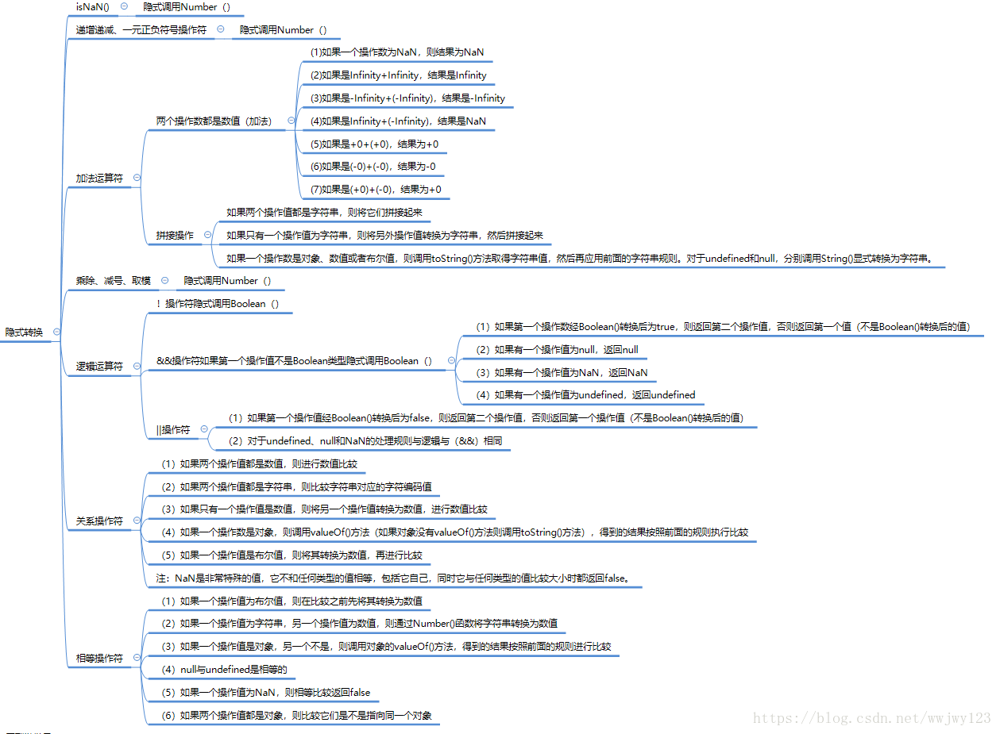

# 前端知识体系


# 一、夯实基础

## 1.1 变量及作用域

### 1.1.1 数据类型

**基本数据类型**
null、undefined、boolean、number、string
**引用数据类型**
Object、Array、Date、RegExp、Function、Math

#### 1. 数据类型判断

```js
//（1）typeof x 【不能区分null和Object类型】
typeof undefined
'undefined'
typeof null
'object'
typeof []
'object'
typeof function(){}
'function'
typeof {}
'object'
typeof 1
'number'
typeof Number(1)
'number'
typeof ''
'string'
typeof String()
'string'
typeof false
'boolean'
typeof Boolean(false)
'boolean'

//（2）obj instanceof Object|Array|Function|Date|RegExp
null instanceof Object
false
undefined instanceof Object
false
1 instanceof Number
false
false instanceof Boolean
false
'' instanceof String
false
String instanceof Object
true
Array instanceof Object
true
Date instanceof Object
true
Function instanceof Object
true
RegExp instanceof Object
true

//（3）Object.prototype.toString.call(x)

//（4）constructor

```

工具类参考utils/typeJS.js(顔海镜)

#### 2. 数据类型转换

转字符串

```js
//(1).toString	null和undefined不可转
false.toString()	//'false'
''.toString()		//''
(0).toString()		//'0'
[1,2,,null,false,undefined].toString()	//"1,2,,false,,"
({a:1,b:'dd',c:null,d:undefined,e:[1,2],f:{f1:22},g:false}).toString() //'[object Object]'

//(2)String(a)		都可转'a',结果同上

//(3)隐式转换 	+''
```

转数值类型

```js
//(1) parseInt(num)|parseFloat(num) 可将任意值转为数字，若要转换的是字符串，会解析直到遇到非数字结束，如果第一个字符不是数字则返回NaN
parseFloat()和parseInt非常相似，不同之处在与parseFloat会解析第一个. 遇到第二个.或者非数字结束如果解析的内容里只有整数，解析成整数。
parseInt(''|null|undefined|{}|[])	//NaN,但
parseInt(['22','3'])结果为22

//（2）Number(a)
Number(false|null|[]|'')	//0
Number(undefined|{})		//NaN

//（3）隐式转换
'222'-0   '222'/1
```

转换布尔类型

```js
//(1) Boolean(obj)
Boolean(0|null|undefined|'')	//false
Boolean({}|[])	//true

//（2）if(a) 条件表达式 !a
```

###### **.valueOf() 和 .toString()**

（1）Object.prototype.valueOf()方法

- 用来返回指定对象的原始值（数值、布尔和字符串）；
- 默认情况下，它会被每个对象继承。每个内置的核心对象都会覆盖此方法以返回适当的值，如果没有原始值就返回对象自身。

| 对象     | 返回值                             |
| -------- | ---------------------------------- |
| Array    | 返回数组对象本身                   |
| Boolean  | 布尔值                             |
| Date     | 存储的时间是从1970.01.01午夜开始的 |
| Function | 函数本身                           |
| Number   | 数字值                             |
| Object   | 对象本身（默认）                   |
| String   | 字符串值                           |
|          | Math和Error没有valueOf()方法       |

（2）Object.prototype.toString()方法

- 返回一个表示该对象的字符串
- 每个对象都有一个toString()方法，当“对象被表示为文本”或“当以期望字符串的字符串方式引用对象”时，该方法会被自动调用。
- 默认情况下，此方法被每个Object对象继承。如果此方法在自定义对象中未被覆盖，toString()返回"[object type]"，其中type是对象的类型。

```js
[].toString()			//''
[2,3].toString()	//'2,3'
Math.toString()		//'[object Math]'
Date.toString()		//'function Date() { [native code] }'
RegExp.toString()	//'function RegExp() { [native code] }'
```

 面试题

```js
[1,2,[3,4],[5,[6,7],8]].toString() //'1,2,3,4,5,6,7,8'
[[[[[22]]]]][0]=='22'	//true
[[[[22]]]]==22				//true
```


###### **隐式类型转换**



```js
//+
2+false			//2
2+true			//3
2+''				//'2'
2+undefined	//NaN
2+null			//2
typeof(2+null)	//'number'
2+[]				//'2'
2+{}				//'2[object Object]'
{}+2				//2
typeof({}+2)//'string'
{}+2+3			//5

//x或y是复杂数据类型 : 会先获取复杂数据类型的原始值之后再左比较
//复杂数据类型的原始值： 先调用valueOf方法，然后调用toString方法
//valueOf:一般默认返回自身
//数组的toString：默认会调用join方法拼接每个元素并且返回拼接后的字符串
[ 1, 2, 3 ] == "1,2,3"	//true
{} == '[object Object]'//true
//==
null===null	//true
undefined === undefined	//true
null == undefined		//true
null === undefined	//false
NaN === NaN	//false
NaN == NaN	//false
true == 1		//true
true == 2		//false 由此可见，bool和Number比较，应该是转数字
[] == 0		//true
{} == 0		//VM515:1 Uncaught SyntaxError: Unexpected token '=='
![] == 0	//true
!{} === false//true
```

###### 面试题

```js
//注意:八种情况转boolean得到false: 0 -0 NaN undefined null '' false document.all()

console.log([] == 0); //true 
// 分析:
//(1) [].valueOf().toString() == 0  
//(2) Number('') == 0  
//(3) false == 0  
//(4) 0 == 0
console.log(![] == 0); //true
// 分析: 
//逻辑非优先级高于关系运算符 ![] = false (空数组转布尔值得到true)
        
console.log([] == []); //false
console.log([] == ![]); //true
//[] 与右边逻辑非表达式结果比较
//(1) [] == !Boolean([])   
//(2) [] == !true  
//(3)[] == false  
//(4) [].toString() == false  
//(5)'' == false   
//(6)Number('0') == Number(false)
Boolean([])
true
Boolean({})
true

console.log({} == {}); //false
console.log({} == !{}); //false
// {} 与右边逻辑非表达式结果比较
//(1){} == !{} 
//(2){} == !true  
//(3){} == false  
//(4){}.toString() == false  
//(5)'[object Object]' == false  
//(6)Number('[object Object]') == false
```

### 1.1.2 变量

#### 1. 变量的命名规则

​        变量必须以字母开头，也可以用$和_开头（但是不推荐使用）

​        变量名称对大小写敏感

​        可以用驼峰法命名

**声明变量的关键字**

- var
- let
- const

#### 2. 变量的声明和赋值


##### **变量提升**

​		在ES5版本及之前，JavaScript中只有全局作用局和函数作用域，if等代码块内声明的变量作用在if语句所在作用域。所以我们存在以下场景：

- 在函数内访问一个函数内没有定义的变量时，会从函数的上一层作用域内寻找，直至找到或遍历到window；
- 在函数内访问一个函数内部有且和外部变量重名的变量时，会存在变量的提升，即在进入函数内部时会创建一个新的变量，其值为undefined，等执行到真正的赋值语句时才进行赋值；
- let、const声明的变量及函数表达式不进行提升，存在暂时性死区；

```js
var v='Hello World';
(function(){
    alert(v);
})()
//输出：Hello World

var v='Hello World';
(function(){
    alert(v);
    var v='I love you';
})()
//输出undefined

function foo() {
    var x = 1;
    if (x) {
        (function () {
            var x = 2;
            // some other code
        }());
    }
    // x is still 1.
}
```


##### **暂时性死区**

​		当程序的控制流程在进入新的作用域进行实例化时，作用域中用let、const创建的变量虽然先被创建出来，但还未进行词法绑定，所以不能访问。在主流程进入作用域创建变量到变量可以被访问这一段区间称为“暂时性死区”。

```js
var tmp = 123;

if (true) {
  tmp = 'abc'; // ReferenceError
  let tmp;
}
```

ES6 明确规定，如果区块中存在let和const命令，这个区块对这些命令声明的变量，从一开始就形成了封闭作用域。总之，在代码块内，使用let命令声明变量之前，该变量都是不可用的。凡是在声明之前就使用这些变量，就会报错。

#####  变量作用域

```js
var a = 100;     
  
 func();
 
 function func(){
     console.log(a);
     var a=200;        
     console.log(a);
 }

var a=100;
var obj1={
    attr:'hello'
};
func(a,obj1);
function func(num,obj){
    var a2=num;
    a2=200;

    var obj2=obj;
    obj2.attr='hello222';
}
console.log(a);	//100
console.log(obj1.attr);	//hello222

```

**使用var定义与不使用var定义**

```js
//注意观察configurable
obj = {
  a:2,
  b:[1,2,3],
  c:{c1:23}
}
Object.getOwnPropertyDescriptor(window,"obj")
{value: {…}, writable: true, enumerable: true, configurable: true}configurable: trueenumerable: truevalue: {a: 2, b: Array(3), c: {…}}writable: true[[Prototype]]: Object

var obj2 = obj
Object.getOwnPropertyDescriptor(window,"obj2")
{value: {…}, writable: true, enumerable: true, configurable: false}configurable: falseenumerable: truevalue: {a: 111, b: Array(3), c: {…}}writable: true[[Prototype]]: Object
window.obj
```


#### 3. 变量的存储

​		内存分为栈（stack）和堆（heap）、池(一般也会归类为栈中)。其中，栈存放变量，堆存放复杂对象，池存放常量。

**栈**是只能在某端进行插入和删除的数据结构，进出栈的一端称为栈顶，另一端为栈底，具有”先进后出“的特点。

优点：存取速度快，速度仅次于CPU的寄存器，适于查询；

缺点：栈中的数据大小和生存期必须是确定的，缺乏灵活性。

**堆**用于动态分配和释放程序声明对象所使用的空间。

优点：生存期不必实现告诉编译器，垃圾收集器自动回收不再使用的数据，释放存储空间；

缺点：在运行时动态分配内存，存取速度较慢。

​		JS中的数据分简单|基本数据类型和引用数据类型。

**简单类型数据**占用内存比较小，适合放在栈中。

- 值有固定大小，往往存储在栈中（变量名和变量值，闭包除外），由系统自动分配存储空间；
- 值与值之间相互独立，修改一个变量不会影响其他变量。

**引用类型数据**JS是弱类型语言，Array大小可动态改变，对于值大小不固定的对象，适于放在堆中。

- 数据保存在堆中，然后栈中存储变量名和指向堆中数据的引用（地址指针），每创建一个新的引用类型数据，就会在堆内存中开辟一个新的空间；
- 变量保存的是引用地址，如果两个变量保存的是对同一个对象的引用，当一个变量修改属性时，另一个也会收到影响。
- 当清空一个变量的值时，指示断开该变量与对象的联系，另一个对象并不受影响。

*所以，在进行数据比较的时候，如果是===比较的时候需要先比较数据类型，再比较值；如果是==比较，如果都是基本数据类型，则直接比较值，如果类型不同，则先进行类型转换再进行比较。*

##### 内存分配

当我们声明变量、函数或对象时，系统自动为他们分配内存。

##### 内存使用

读写内存使用变量、函数、对象等。

##### 内存回收

JS有自动垃圾收集机制，找出不再使用的值，释放其占用的内存。垃圾收集器每隔固定时间段就执行一次释放操作。

- 在局部作用域中，函数执行完毕，局部变量没有存在的必要了，因此垃圾收集器很容易做出判断并回收。但是全部变量何时需要释放内存空间很难判断，所以我们在开发时要尽量避免使用全局变量，适当时候解除引用以确保性能。
- “引用计数”方法是记录所有值被引用的次数，但是对于代码中使用循环引用时，算法就会导致问题一直无法释放内存，主流引擎已不使用；
- “标签清除”是目前主流的垃圾收集算法，是给当前不使用的值加上标记，然后再回收其内存；
- 解除变量引用不仅可以消除循环引用现象，而且可以及时进行垃圾回收。通常我们将变量置为null使数值脱离执行环境，在下一次垃圾回收时释放空间。
- Google V8引擎的所有对象都是通过堆来进行内存分配的，当我们在声明对象并赋值时，V8引擎就会堆内存中分配一部分给这个变量。如果 已申请的内存不足以存储变量时，V8引擎就会继续申请内存，直到堆的大小达到V8引擎内存上限（默认64位系统中为1463MB，32位系统中为732MB）。另外，V8引擎对JS对象进行分代管理。
  - 新生代——存活周期较短的JS对象，如：临时变量、字符串等；
  - 老生代——为经过多次垃圾回收仍然存活，存活周期较长的对象，如：主控制器、服务器对象等。

```js
var b1="eye";
var b2="ear";
var b3="arm"; 
var old=[b1,b2,b3];
var newer=old;
newer	//['eye', 'ear', 'arm']
b1='foot'
newer	//['eye', 'ear', 'arm']

function fun1() {
    var obj = {name: 'csa', age: 24};
}
function fun2() {
    var obj = {name: 'coder', age: 2}
    return obj;
}

var f1 = fun1();
var f2 = fun2();
f1	//undefined
f2	//{name: 'coder', age: 2}
obj1//VM438:1 Uncaught ReferenceError: obj1 is not defined at <anonymous>:1:1（匿名） @ VM438:1
obj2//{a: 111, b: Array(3), c: {…}}
obj2=null
obj2	//undefined
```

#### 4. 深浅拷贝问题

​		这是有变量数据类型和内存存储所引发的一个变量赋值问题。

**浅拷贝**

​		拷贝是通过赋值来完成，即在栈内存中创建一个新的存储空间来存储变量名和值。

- 如果是基本类型数据，拷贝的就是基本数据类型的值，拷贝之后栈内存中存在两个数据备份，两者相互独立、互不影响；
- 如果是引用类型数据，拷贝的就是引用类型数据的引用地址，拷贝之后两个变量同时指向堆内存的同一份数据，如果其中一个改变对象中的数据（不管是简单类型，还是复杂类型），那么另一个在访问时数据已经发生改变。

这种现象叫做浅拷贝。以下方法都是浅拷贝：

```js
Object.assign(target,...sources)
//只会拷贝源对象自身的可枚举类型属性，可以拷贝Symbol类型对象
let objClone = {..obj}
//也仅适用于基本类型
Array.prototype.concat(val1,[val2],...,valN)
Array.prototype.slice(begin,end)
//仅适用于基本类型数组
```

**深拷贝的概念：**

- 创建一个一模一样的对象，新对象和源对象完全不共享堆内存；
- 修改新对象的数据不会改变源对象。

##### Object.assign(target,...sources)

```js
比如：Object.assign 方法只会拷贝源对象自身的并且可枚举的属性到目标对象，假如源值是一个对象的引用，它仅仅会复制其引用值。
//注意:
//Object.assign 不会在那些source对象值为 null 或 undefined 的时候抛出错误。
//只有个字符串和包装对象（原始类型会被包装为对象）才具有可枚举属性，继承属性和不可枚举属性是不能拷贝的.
//异常会打断后续拷贝任务
const v1 = "abc";
const v2 = true;
const v3 = 10;
const v4 = Symbol("foo")
const v5 = {[Symbol("foo")]:'foot'};
const obj = Object.assign({}, v1, null, v2, undefined, v3, v4);
const obj2 = Object.assign({}, v1, null, v2, undefined, v3, v4,v5);
console.log(obj); // { "0": "a", "1": "b", "2": "c" }
console.log(obj2);// {0: 'a', 1: 'b', 2: 'c', Symbol(foo): 'foot'}

const target = Object.defineProperty({}, "foo", {
    value: 1,
    writable: false
}); // target 的 foo 属性是个只读属性。

Object.assign(target, {bar: 2}, {foo2: 3, foo: 3, foo3: 3}, {baz: 4});
// TypeError: "foo" is read-only
// 注意这个异常是在拷贝第二个源对象的第二个属性时发生的。
console.log(target.bar);  // 2，说明第一个源对象拷贝成功了。
console.log(target.foo2); // 3，说明第二个源对象的第一个属性也拷贝成功了。
console.log(target.foo);  // 1，只读属性不能被覆盖，所以第二个源对象的第二个属性拷贝失败了。
console.log(target.foo3); // undefined，异常之后 assign 方法就退出了，第三个属性是不会被拷贝到的。
console.log(target.baz);  // undefined，第三个源对象更是不会被拷贝到的。
```

##### 如何实现深拷贝？

```js
//方法一：
JSON.stringify(value[, replacer [, space]])
JSON.parse(objString)
//官网文档陈述转换规则
- 转换值如果有 toJSON() 方法，该方法定义什么值将被序列化。
- 非数组对象的属性不能保证以特定的顺序出现在序列化后的字符串中。
- 布尔值、数字、字符串的包装对象在序列化过程中会自动转换成对应的原始值。
- undefined、函数以及 symbol 值，在序列化过程中会被忽略（出现在非数组对象的属性值中时）或者被转换成 null（出现在数组中时）。
- 对包含循环引用的对象（对象之间相互引用，形成无限循环）执行此方法，会抛出错误。
- 所有以 symbol 为属性键的属性都会被完全忽略掉，即便 `replacer` 参数中强制指定包含了它们。
- Date 日期调用了 toJSON() 将其转换为了 string 字符串（同Date.toISOString()），因此会被当做字符串处理。
- NaN 和 Infinity 格式的数值及 null 都会被当做 null。
- 其他类型的对象，包括 Map/Set/WeakMap/WeakSet，仅会序列化可枚举的属性。
```

问题：

- 执行会报错：存在`BigInt`类型、循环引用。
- 拷贝`Date`引用类型会变成字符串。
- 键值会消失：对象的值中为`Function`、`Undefined`、`Symbol` 这几种类型，。
- 键值变成空对象：对象的值中为`Map`、`Set`、`RegExp`这几种类型。
- 无法拷贝：不可枚举属性、对象的原型链。

```js
//方式二：遍历+递归
```

问题：

- 不能处理循环引用，容易发生调用栈溢出问题
- 对于bigInt可以正确拷贝，但对于Date、RegExp、Map、Set对象不能正确拷贝
- 丢失了属性名为Symbol类型的属性及不可枚举属性
- 原型上的属性会添加到拷贝对象上去

```js
//优化版：
//1.不能处理循环引用	
使用 WeakMap 作为一个Hash表来进行查询.一种简单的方式就是把已添加的对象记录下来，这样下次碰到相同的对象引用时，直接指向记录中的对象即可。要实现这个记录功能，我们可以借助 ES6 推出的 WeakMap 对象，该对象是一组键/值对的集合，其中的键是弱引用的。其键必须是对象，而值可以是任意的。
//2.只考虑了Object对象	
当参数为 Date、RegExp 、Function、Map、Set，则直接生成一个新的实例返回
//3.丢失了属性名为Symbol的属性及不可枚举的属性
针对能够遍历对象的不可枚举属性以及 Symbol 类型，我们可以使用 Reflect.ownKeys()
注：Reflect.ownKeys(obj)相当于[...Object.getOwnPropertyNames(obj), ...Object.getOwnPropertySymbols(obj)]
//4.原型上的属性
Object.getOwnPropertyDescriptors()设置属性描述对象，以及Object.create()方式继承原型链
```

#### 5. 数据精度问题

bigInt


## 1.3 函数和闭包

### 1.3.1 函数调用传参&返回值

 

### 1.3.2 arguments参数&剩余参数

##### argument对象

**`arguments`** 是一个对应于传递给（非箭头）函数的参数的类数组对象，仅能在函数内部使用。**类数组**它类似于`Array`，但除了length属性和索引元素之外没有任何`Array`属性。

将arguments对象转为数组：

```js
var args = Array.prototype.slice.call(arguments);
var args = [].slice.call(arguments);

//对参数使用slice会阻止某些JavaScript引擎中的优化 (比如 V8 - 更多信息)。
//如果你关心性能，尝试通过遍历arguments对象来构造一个新的数组。
//另一种方法是使用被忽视的Array构造函数作为一个函数
var args = (arguments.length === 1 ? [arguments[0]] : Array.apply(null, arguments));

// ES2015
const args = Array.from(arguments);
const args = [...arguments];
```

##### 剩余参数

**剩余参数**语法允许我们将一个不定数量的参数表示为一个数组，仅能在函数中使用。如果函数的最后一个命名参数以`...`为前缀，则它将成为一个由剩余参数组成的真数组，其中从`0`（包括）到`theArgs.length`（排除）的元素由传递给函数的实际参数提供。

```js
function(a, b, ...theArgs) {
  // ...
}
```

##### [剩余参数和 `arguments`对象的区别]

剩余参数和 `arguments`对象之间的区别主要有三个：

- 剩余参数只包含那些没有对应形参的实参，而 `arguments` 对象包含了传给函数的所有实参。
- `arguments`对象不是一个真正的数组，而剩余参数是真正的 `Array`实例，也就是说你能够在它上面直接使用所有的数组方法，比如 `sort`，`map`，`forEach`或`pop`。剩余参数可以被解构，这意味着他们的数据可以被解包到不同的变量中。
- `arguments`对象还有一些附加的属性 （如`callee`属性）。

### 1.3.3 展开运算符与解构赋值

##### 展开运算符(...)

展开运算符,将一个数组转为用逗号分隔的参数序列。用处：

- **合并数组展开数组；展开对象**
- **函数调用中使用展开运算符**`let params=[1,2,30; test(...params);`
- **用于解构赋值**

##### 解构赋值

**解构赋值**语法是一种 Javascript 表达式。通过**解构赋值,** 可以将属性/值从对象/数组中取出,赋值给其他变量。

```js
[a, b, ...rest] = [10, 20, 30, 40, 50];
//a=10,b=20,rest =  [30, 40, 50]

({a, b, ...rest} = {a: 10, b: 20, c: 30, d: 40});
//a=10,b=20,rest={c: 30, d: 40}
{a, b, ...rest} = {a: 10, b: 20, c: 30, d: 40};
//VM242:1 Uncaught SyntaxError: Unexpected token '...'

//变量声明并赋值时的解构赋值
var [one, two, three] = foo;
//变量先声明后解构赋值
var a, b;
[a, b] = [1, 2];
//为了防止从数组中取出一个值为`undefined`的对象，可以在表达式左边的数组中为任意对象预设默认值。
//[a=5, b=7] = [1];
var {a:aa = 10, b:bb = 5} = {a: 3};

//在一个解构表达式中可以交换两个变量的值。
var a = 1;
var b = 3;
[a, b] = [b, a];
//解析一个从函数返回的数组,可以忽略某些返回值
function f() {
  return [1, 2, 3];
}
var a, b;
[a, ,b] = f();
//可以从一个对象中提取变量并赋值给和对象属性名不同的新的变量名。
var o = {p: 42, q: true};
var {p: foo, q: bar} = o;
console.log(foo); // 42
console.log(bar); // true 
```

###### for of和解构赋值

```js
var people = [
  {
    name: 'Mike Smith',
    family: {
      mother: 'Jane Smith',
      father: 'Harry Smith',
      sister: 'Samantha Smith'
    },
    age: 35
  },
  {
    name: 'Tom Jones',
    family: {
      mother: 'Norah Jones',
      father: 'Richard Jones',
      brother: 'Howard Jones'
    },
    age: 25
  }
];

for (var {name: n, family: {father: f}} of people) {
  console.log('Name: ' + n + ', Father: ' + f);
}
// "Name: Mike Smith, Father: Harry Smith"
// "Name: Tom Jones, Father: Richard Jones"
```

###### 对象中的解构赋值

```js
//从作为函数实参的对象中提取数据
function userId({id}) {
  return id;
}
function whois({displayName: displayName, fullName: {firstName: name}}){
  console.log(displayName + " is " + name);
}
var user = {
  id: 42,
  displayName: "jdoe",
  fullName: {
      firstName: "John",
      lastName: "Doe"
  }
};
console.log("userId: " + userId(user)); // "userId: 42"
whois(user); // "jdoe is John"

//对象属性计算名和解构
let key = "z";
let { [key]: foo } = { z: "bar" };
console.log(foo); // "bar"
//对象解构中的rest
let {a, b, ...rest} = {a: 10, b: 20, c: 30, d: 40}
//无效的JavaScript标识符作为属性名称
const foo = { 'fizz-buzz': true };
const { 'fizz-buzz': fizzBuzz } = foo;
console.log(fizzBuzz); // "true"
//解构对象时会查找原型链
var obj = {self: '123'};
obj.__proto__.prot = '456';
const {self, prot} = obj;
// self "123"
// prot "456"（访问到了原型链）
```

##### for of 与 for in

- for..of适用遍历数/数组对象/字符串/map/set等拥有迭代器对象的集合.但是不能遍历对象,因为没有迭代器对象.与forEach()不同的是，它可以正确响应break、continue和return语句
- for-of循环不支持普通对象，但如果你想迭代一个对象的属性，你可以用for-in循环（这也是它的本职工作）或内建的Object.keys()方法：

```jsx
for (var key of Object.keys(someObject)) {
  console.log(key + ": " + someObject[key]);
}
```

- 遍历map对象时适合用解构,例如:

```csharp
for (var [key, value] of phoneBookMap) {
   console.log(key + "'s phone number is: " + value);
}
```

- **当你为对象添加myObject.toString()方法后，就可以将对象转化为字符串，同样地，当你向任意对象添加myObject[Symbol.iterator]()方法，就可以遍历这个对象了。**
   举个例子，假设你正在使用jQuery，尽管你非常钟情于里面的.each()方法，但你还是想让jQuery对象也支持for-of循环，你可以这样做：

```jsx
jQuery.prototype[Symbol.iterator] = Array.prototype[Symbol.iterator];
```

所有拥有[Symbol.iterator]()的对象被称为可迭代的。在接下来的文章中你会发现，可迭代对象的概念几乎贯穿于整门语言之中，不仅是for-of循环，还有Map和Set构造函数、解构赋值，以及新的展开操作符。

- for...of的步骤

  ​		for-of循环首先调用集合的[Symbol.iterator]()方法，紧接着返回一个新的迭代器对象。迭代器对象可以是任意具有.next()方法的对象；for-of循环将重复调用这个方法，每次循环调用一次。举个例子，这段代码是我能想出来的最简单的迭代器：

```jsx
var zeroesForeverIterator = {
 [Symbol.iterator]: function () {
   return this;
  },
  next: function () {
  return {done: false, value: 0};
 }
};
```


### 1.3.4 箭头函数

箭头函数的语法比函数表达式更简洁，并且没有自己的this,arguments,super或new.target。适用于那些本来需要匿名函数的地方，并且它不能用作构造函数。

```js
(param1, param2, …, paramN) => { statements }
(param1, param2, …, paramN) => expression
//相当于：(param1, param2, …, paramN) =>{ return expression; }
```

- 当没有参数时写为`()=>{}`当只有一个参数时，（）可选；
- 加括号的函数体返回对象字面量表达式，否则返回undefined；当函数体没有用`{}`包裹时，自动返回表达式计算结果值；
- 支持剩余参数和默认参数、解构赋值。
- 箭头函数在参数和箭头之间不能换行，可以通过在 ‘=>’ 之后换行，或者用 ‘( )’、'{ }'来实现换行

```js
// 当箭头函数只有一个参数时，可以省略参数的圆括号
elements.map(element => {
 return element.length;
}); // [8, 6, 7, 9]

// 当箭头函数的函数体只有一个 `return` 语句时，可以省略 `return` 关键字和方法体的花括号
elements.map(element => element.length); // [8, 6, 7, 9]
```


### 1.3.5 函数作用域和执行上下文

- 函数体内的`this`对象，就是定义时所在的对象，而不是使用时所在的对象。
- 箭头函数本身没有this，this继承上级的this。
- 定时器中箭头函数的this指向包含定时器的函数

### 1.3.6 纯函数

一个函数的返回结果只依赖于它的参数，并且在执行过程里面没有副作用，我们就把这个函数叫做纯函数。

```
一个函数在执行过程中还有很多方式产生外部可观察的变化，比如：
1.修改外部变量（全局|对象的）；
2.比如说调用 DOM API 修改页面；
3.或者你发送了 Ajax 请求；
4.还有调用 window.reload 刷新浏览器，
5.甚至是 console.log 往控制台打印数据也是副作用
```


# 二、高级进阶
## 2.1 闭包

因为函数内部声明 的变量是局部的，只能在函数内部访问到，但是函数外部的变量是对函数内部可见的，这就是作用域链的特点（子级可以向父级查找变量，逐级查找，找到为止）

闭包的概念

指有权访问另一个函数作用域中的变量的函数，一般情况就是在一个函数中包含另一个函数。

闭包的作用

访问函数内部变量、保持函数在环境中一直存在，不会被垃圾回收机制处理。

闭包的使用场景

- 在函数外使用函数内的变量，避免全局变量污染，如：组件封装（jQuery组件封装）
- 函数作为参数传递
- 函数柯里化（提高函数适用性，如：将函数与其所操作的某些数据关联起来，设置页面内容字体为固定大小）
- 用闭包模拟私有变量（vue组件封装data；防抖、节流函数中的定时器）
- 循环中使用闭包绑定实时变量

```js
//方式1
function callback(i){
  return function(){
    console.log(i)
  }
}
for(var i=0;i<10;i++){
  setTimeout(callback(i),1000*i);
}
//方式2 立即执行函数
for(var i=0;i<10;i++){
  (function(i){
    setTimeout(i=>{
      console.log(i);
    },100*i);
  })(i);
}
//方式3 let变量
for(var i=0;i<10;i++){
  setTimeout(i=>{
      console.log(i);
  },1000*i);
}
```


闭包的优点：

- 方便调用上下文中声明的局部变量
- 逻辑紧密，可以在一个函数中再创建个函数，避免了传参的问题

闭包的缺点：

   因为使用闭包，可以使函数在执行完后不被销毁，保留在内存中，如果大量使用闭包就会造成内存泄露，内存消耗很大。

## 2.2 原型及原型链


## 2.3 类和继承


## 2.4 异步

同步（阻塞模式）

异步（非阻塞模式）

### 2.4.1 回调函数

##### 1. callback

##### 2. Promise

​		ES6新增Promise 对象用于解决“回调地狱”的问题，它可以将异步操作以同步操作的流程表达出来，避免了层层嵌套的回调函数。此外，Promise 对象提供统一的接口，使得控制异步操作更加容易。

Promise 也有一些缺点。

- 首先，无法取消 Promise，一旦新建它就会立即执行，无法中途取消。
- 其次，如果不设置回调函数，Promise 内部抛出的错误，不会反应到外部。
- 第三，当处于 Pending 状态时，无法得知目前进展到哪一个阶段（刚刚开始还是即将完成）。

### 2.4.2 事件监听


### 2.4.3 定时器


### 2.4.4 发布订阅模式


# 三、功能

## 3.1 文件上传下载

https://segmentfault.com/a/1190000019359452?utm_source=tag-newest
